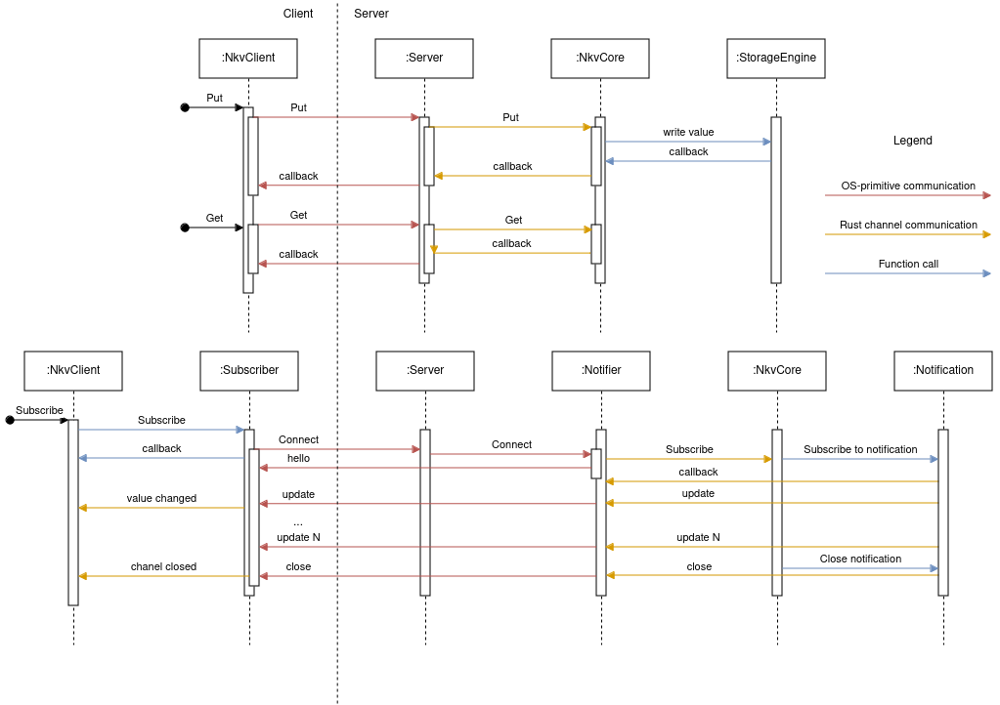

# Notify Key Value Storage (nkv)

### What is it for? 
nkv lets you share state between your services using client server topology. 
it provides you with following API:

- get the state for the given key
- put the state for the given key
- delete the state for the given key
- subscribe to the updates for the given key

Note that nkv supports keyspace, more info you can find [here](./docs/KEYSPACE.md)

### When should I use it?
When you have some shared state between services/processes and you also want to be notified when the value is changed

### How do I use it?

Start a server by running the binary `nkv-server`, passing it the hostname and port on which to listen,
e.g. `localhost:8000`. If you pass none, it defaults to `localhost:4222`. 

```sh
nkv-server localhost:4222
```

Then you can use a client to access the server.

You can use the client binary `nkv-client` to interact with the server, or any library that supports the
protocol.

To run the client binary, you can use the following commands:

```sh
$ nkv-client localhost:4222
get key1
put key1 value1
delete key1
quit
help
```

Each line starts with the command, followed by the arguments. Enter the `help` command
for a list of available commands. Each command ends with a newline character, after which the server
responds.

The first and only argument to `nkv-client` is the hostname and port on which the server is running.
If none is provided, it defaults to `localhost:4222`.

### How do I use it in my Rust project?

To use the client library in your Rust project:

```rust
let url = "localhost:4222".to_string();
let mut client = NkvClient::new(&url);

let value: Box<[u8]> = Box::new([9, 7, 3, 4, 5]);
let key = "test_2_key1".to_string();

let resp = client.put(key.clone(), value.clone()).await.unwrap();
print!("{:?}", resp);
// status: 200
// message: "No Error"

let get_resp = client.get(key.clone()).await.unwrap();
print!("{:?}", resp);
// status: 200
// message: "No Error"
// data: [9, 7, 3, 4, 5]

let sub_resp = client.subscribe(key.clone()).await.unwrap();
print!("{:?}", sub_resp);
// status: 200
// message: "Subscribed"


_ = client.delete(key.clone()).await.unwrap();
```

To use the server in your rust project:

```rust
let temp_dir = TempDir::new().expect("Failed to create temporary directory");
let url = "127.0.0.1:8092";

let srv = Server::new(url.to_string(), temp_dir.path().to_path_buf())
    .await
    .unwrap();
tokio::spawn(async move {
    srv.serve().await;
});
```

### In the server, can I use it between threads inside one program?

Yep, you can use channels to communicate with server

```rust
let temp_dir = TempDir::new().expect("Failed to create temporary directory");
let url = "127.0.0.1:8091";

let srv = Server::new(url.to_string(), temp_dir.path().to_path_buf())
    .await
    .unwrap();

let put_tx = srv.put_tx();
let get_tx = srv.get_tx();
let del_tx = srv.del_tx();
let sub_tx = srv.sub_tx();

tokio::spawn(async move {
    srv.serve().await;
});

let value: Box<[u8]> = Box::new([1, 2, 3, 4, 5]);
let key = "key1".to_string();
let (resp_tx, mut resp_rx) = mpsc::channel(1);

let _ = put_tx.send(PutMsg{key: key.clone(), value: value.clone(), resp_tx: resp_tx.clone()});

let message = resp_rx.recv().await.unwrap();
// nkv::NotifyKeyValueError::NoError
print!("{:?}", message);

let (get_resp_tx, mut get_resp_rx) = mpsc::channel(1);
let _ = get_tx.send(GetMsg{key: key.clone(), resp_tx: get_resp_tx.clone()});
let got = get_resp_rx.recv().await.unwrap();
// [1, 2, 3, 4, 5] 
print!("{:?}", got.value.unwrap());

let addr: SocketAddr = url.parse().expect("Unable to parse addr");
let stream = TcpStream::connect(&url).await.unwrap();
let (_, write) = tokio::io::split(stream);
let writer = BufWriter::new(write);

let _ = sub_tx.send(SubMsg {
    key: key.clone(),
    resp_tx: resp_tx.clone(),
    addr,
    writer,
});
let message = resp_rx.recv().await.unwrap();

// nkv::NotifyKeyValueError::NoError
print!("{:?}", message);

let _ = del_tx.send(BaseMsg{key: key.clone(), resp_tx: resp_tx.clone()});
let got = resp_rx.recv().await.unwrap();
// nkv::NotifyKeyValueError::NoError
print!("{:?}", got);
```

### How does it work exactly?

`NotifyKeyValue` is a map of String Key and a value containing `PersistValue` and `Notiffier`.
`PersistValue` is an object, which stores your state (some variable) on file system, so that
you can restart your application without worrying about data loss. `Notifier` on the other hand
handles the channel between server and client to notify latter if anybody changed value. This 
channel is a OS-primitive (sockets) so you can 
write clients in any programming language you want. Last two components are `Server` and `NkvClient`.
Former creates `NotifyKeyValue` object and manages its access from asynchronous requests. It does 
so by exposing endpoints through some of the OS-primitive (socket), so again, clients could
be in any programming language you like; Latter is used to connect to `Server` and implement the API
(see what is it for section)

You can call those components interfaces, and implement them differently to tailor to your particular 
case, i.e. use mysql for persist value or unix domain socket for `Notfifier` and TCP for `Server` 

From the flow diagram you can see how `NotifyKeyValue` processes requests.



`NkvClient` sends requests to `Server` through a connection and `Server` interacts with `NotifyKeyValue`
struct via Rust channels and `NotifyKeyValue` struct (or `Nkv`) interacts then with `PersistValue` to store
value on a file system and `Notifier` which sends to `Subscribers` updates whenever value is changed and
send Close message whenever value is deleted.
The way `Server` is handling *subscribe* is different from other API calls: TCP connection is not closed,
but rather kept open to send messages to `Subscriber`. So `NkvClient` when called `subscribe()` creates a 
`Subscriber` struct and stores it, which in turns in its own thread listens to messages comming from `Nkv`
via `Notifier` and newest value would be sent to `tokio::watch` channel.

### Can I use any other language than Rust?

Yes, underlying design principle is that nkv is using OS primitives, making it possible to write clients in any language.
Just write marshalling and demarshalling in JSON and be sure that you can connect to `Server` and handle `Notifier`

### Background

Initially, idea for such design came up in discussions with @deitch talking about improving messaging
system inside [EVE project](https://github.com/lf-edge/eve) called PubSub. We clearly understood one thing:
serverless distributed messaging between services did was not exactly the right way to approach the problem.
What we actually needed was some kind of persistent key-value storage, but with a twist: we want it to notify us when 
there is a change in a value. So all the clients will be able to sync over the value.
Such communication mechanism would be perfect for EVE. In terms of performance the important part for us was
smaller footprint and we also kept in mind that number of connections will be hundreds maximum.

